.. _find_en:

====================================
How to Find and Visualise Your Data
====================================

This section explains how to discover resources in KMaP, apply filters to narrow your
search, and explore the detail page and preview of a Dataset.

Accessing the Catalogue
========================

The KMaP catalogue lists all public resources and all resources shared with your group.
There are two main ways to reach it:

1. **From the navigation bar** – click **Maps** (for spatial resources) or **Library**
   (for documents and publications) in the top menu.
2. **Directly via URL** – navigate to https://kmap.info-rac.org/maps/#/

The catalogue page displays resources as cards, each showing a thumbnail, title, resource
type, and summary metadata.

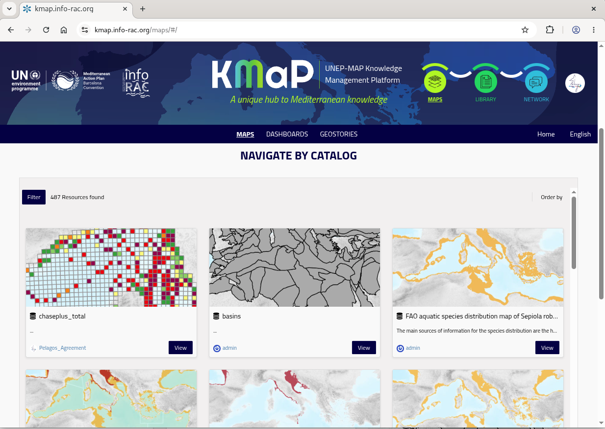

    Catalogue initial view

.. tip::
   Make sure you are **logged in** to see resources that are shared exclusively with the
   Pelagos Agreement group. Resources restricted to your group are not visible to
   unauthenticated users. As a contributor you will also have the editing rights on the related resources only if youre logged in.
   To view the catalog as a contributor and to access the resources for editing purposes see :ref:`metadata_en`

Filtering and Searching the Catalogue
======================================

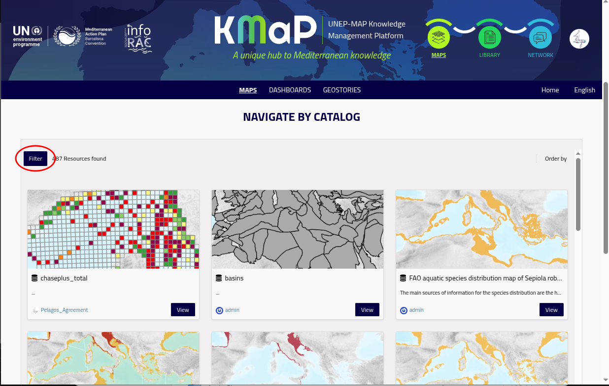

    Catalogue filter button

The initial view of the catalogue contains all the resources (maps and datasets) that your user is allowed to see. 
You need to use the **Filter** tool to restrict the list of resources and find the dataset or map of your interest.

Using the Search Bar
--------------------

Clicking on the ``Filter`` button on top left cornere of the catalogue view will open the filter panel. 
There are two tabs and by default the tab with Kmap categories is selected. The search bar is on the topo of the filter panel and accepts free-text queries. 
It searches across titles, abstracts, and keyword fields.

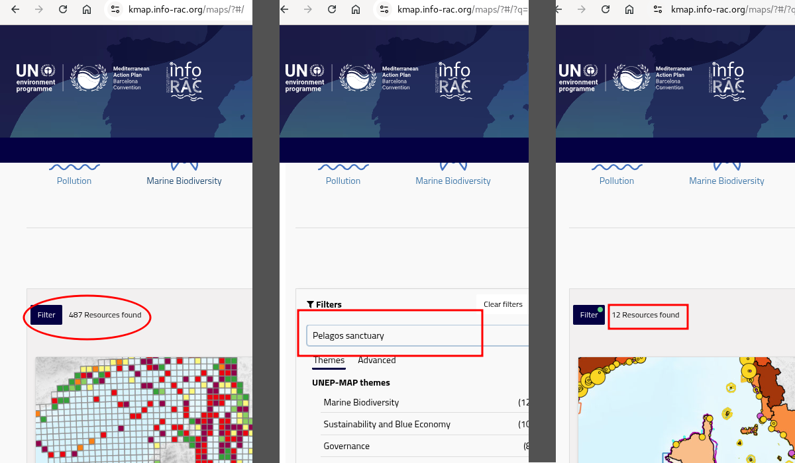

    Sequence of filtering catalogue using search bar 

To find Pelagos-related content:

1. Type ``pelagos sanctuary`` in the search bar and press **Enter**.
2. Alternatively, search for ``pelagos agreement`` to retrieve resources tagged
   with that keyword.

.. note::
   Both ``pelagos sanctuary`` and ``pelagos agreement`` are controlled keywords used by
   the Pelagos Agreement group when publishing resources on KMaP. Using these exact terms
   will return the most relevant results.

As long as you type into the search bar the catalogue view will update: hide the filter panel to view the number of filtered resource.
the appearance of the ``Filter`` butotn will change. Remember to click on ``Clear filters`` before make a new search

.. _advanced_filter:

Using advanced filter
---------------------

On the ``Advanced`` tab of the filter panel you will find a detailed list of filters based on the metadata fileds of the resources.
Filters can be combined freely and are applied immediately.

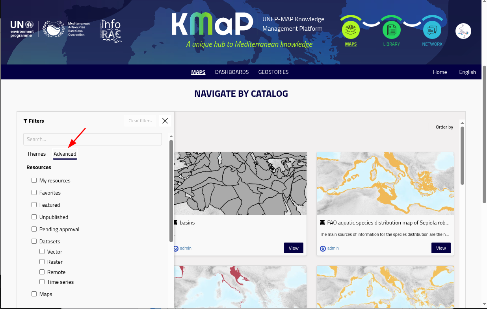

    Filter for Pelagos datasets

.. list-table::
   :widths: 25 75
   :header-rows: 1

   * - Filter
     - How to use it
   * - **Resource type**
     - Select *Dataset*, *Document*, *Map*, *GeoStory*, or *Dashboard* to restrict
       results to one type.
   * - **Keywords**
     - Type or select a keyword (e.g. ``pelagos agreement``) to filter by thematic tag.
   * - **Category / Theme**
     - Select a thematic category such as *Marine Biodiversity* or *Governance*.
   * - **Date**
     - Filter by publication or modification date range.
   * - **Owner**
     - Filter by the user or organisation that published the resource.
   * - **Extent**
     - Draw a bounding box on the mini-map to filter by geographic area.

.. tip::
   To find all Pelagos-related datasets quickly:

   1. Set **Resource type** → *Dataset*
   2. In the **Keywords** filter, type ``pelagos agreement``
   3. The catalogue will update to show only datasets tagged with that keyword. 

Step-by-Step Example: Finding a Pelagos Dataset
=================================================

The following example walks through finding, previewing, and reading the metadata of a
Dataset relevant to the Pelagos Agreement.

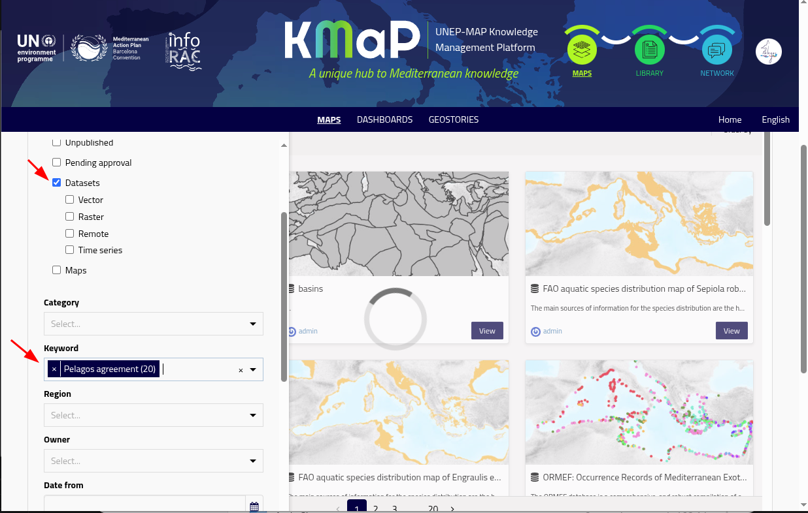

    Filter for Pelagos datasets

Step 1 – Open the catalogue
----------------------------

    Open filter panel

Go to https://kmap.info-rac.org and click **Maps** in the top navigation bar.
This opens the  catalogue, filtered to spatial resource types (datasets and maps).
Click on the ``Filter`` button then select **Advanced** tab

Step 2 – Filter to Datasets only
--------------------------------

    Advanced filter

In the **Advanced** tab of the filter panel, under **Resources** list of checkbox, tick **Dataset**.
The list now shows only resource of type datasets.

Step 3 – Search by keyword
---------------------------

In the **keyword** form field start typing ``pelagos agreement`` and select this exact keyword from the dropdown list.

All the scientific calls results has been tagged with this keyword (two words). 
Other resources not managed by the agreement but regarding the Pelagos sanctuary may have the ``pelegos sanctuary`` keyword.

The catalogue now list only the resources of type datasets that are tagged with keyword **Pelagos agreement**

    Filter for Pelagos datasets

Step 4 – Select a Dataset
--------------------------

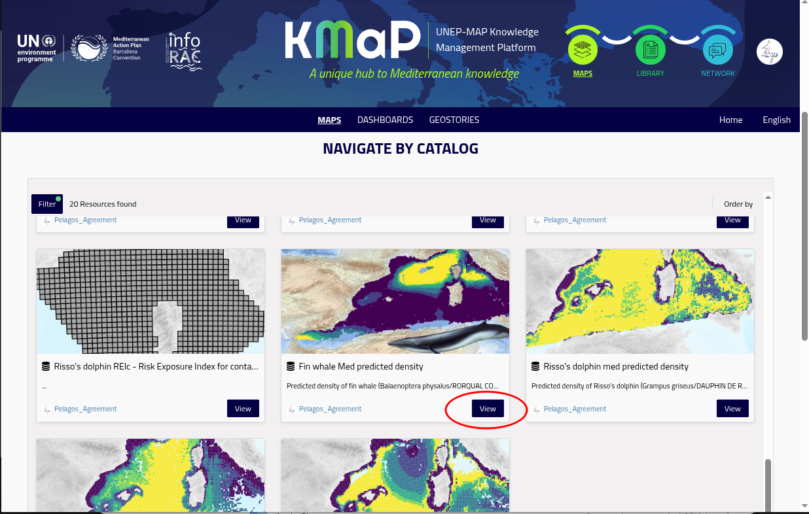

    The view button

Click on the ``View`` button of a dataset card to open its **detail page**.

The Dataset Detail Page
========================

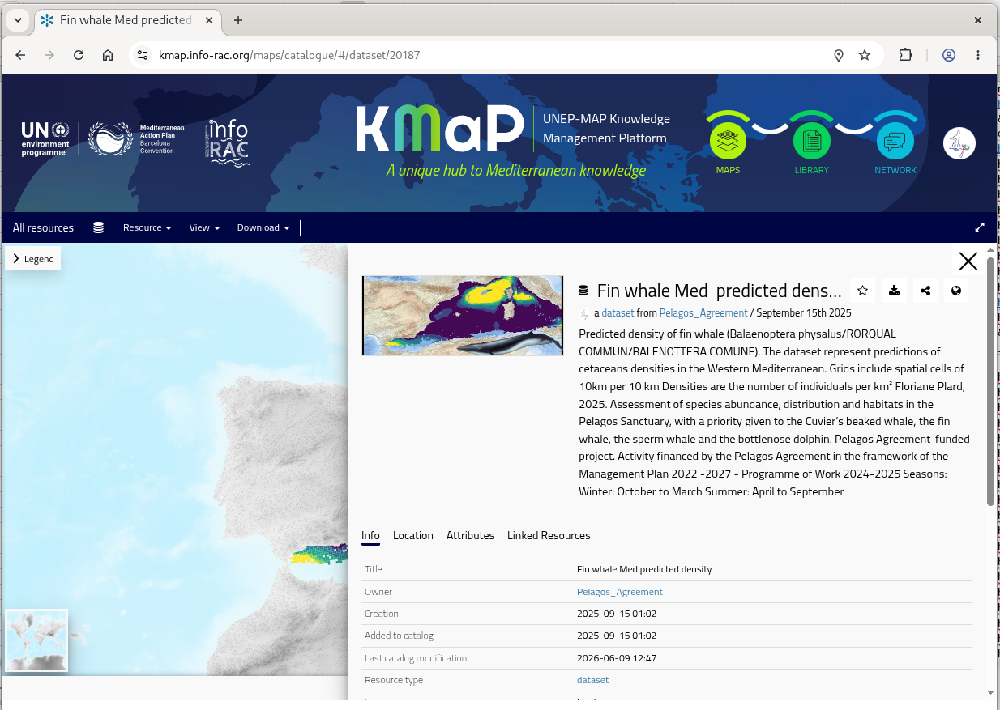

    The dataset detail page

The detail page contains the main information for any resource. It is divided into
several sections.

Information Panel
-----------------

The resource detail page by default shows the **information panel** that summarize the essential elements of the dataset.

On the top left of the panel there is the  **map thumbnail** usualy a small preview image of the dataset. 
The thumbnail can be replaced by the users that have edit permissions on metadata. 

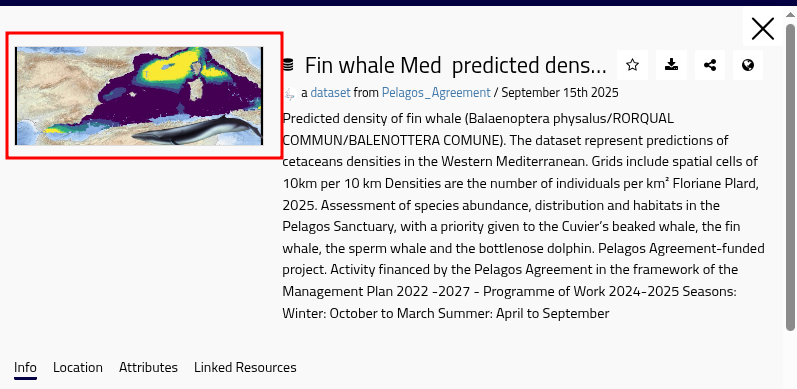

    Thumbnail area in information panel

On the top center of the panel there is the title of the dataset and just below it the owner of this resource. 
Clicking on the ownner's name you will 

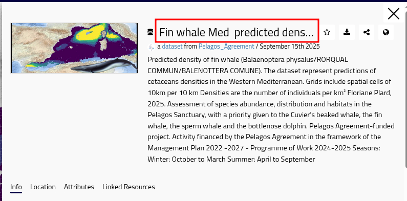

    Dataset title in information panel

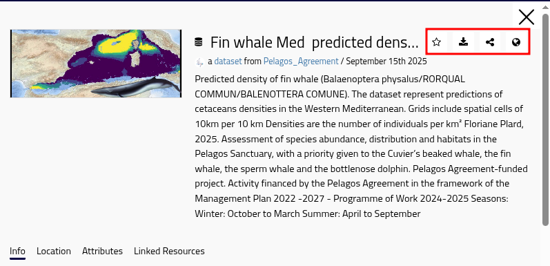

    Dataset Action Button

* The action buttons :

  *  |favorite_bt| **Add to favorites** – Adds this dataset to your favorites. You can easy find your favorites using  :ref:`advanced filter <advanced_filter>`
  *  |download_bt| **Download** – downloads the dataset in ESRI Shapefile format (for vector datasets) or Geotiff (for raster datasets).
  *  |share_bt| **Share** – copies the permalink to the resource.
  *  |service_bt| **OGC services** – copies the URL of OGC services (WMS and WCS/WFS depending on user's authorization) for this dataset only

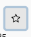

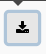

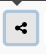

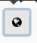

Metadata Preview
----------------

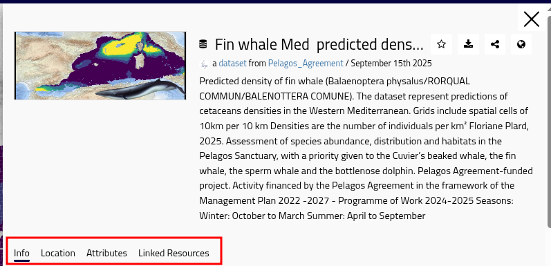

    The tabs of metadata preview

The **info** tab contains detailed information about the
dataset. The key fields are:

.. list-table::
   :widths: 30 70
   :header-rows: 1

   * - Field
     - Description
   * - **Owner**
     - The user or organisation responsible for the dataset.
   * - **Creation/Added to Catalog/Last modification**
     - Dates of creation, addition to the catalogue, and last modification.
   * - **Resource type**
     - Dataset, Map, Document, GeoStory, or Dashboard.
   * - **Category**
     - The INSPIRE or thematic category (e.g. *Marine Biodiversity*).  
   * - **Point of contact**
     - Usually metadata manager or dataset owner.
   * - **Attribution**
     - Copyright and credit information for the dataset.              
   * - **Keywords**
     - Thematic and geographic tags.
   * - **Regions**
     - The geographic regions related to the dataset.
   * - **Licence**
     - The usage licence (e.g. Creative Commons, ODbL, …).
   * - **Point of contact**
     - Who to contact for questions about the data.
   * - **Supplemental Information**
     - Other information mainly related to origin of the dataset
   * - **Related resources**
     - Links to Maps, Documents, or other Datasets connected to this resource.

On the bottom of the **info** tab there is a link to the **full metadata** page.
The other tabs **Location** and **Attributes** show the extent and attribute of the dataset.
The tab  **Linked resources** shows the resources that are linked to this dataset.

Full Metadata Page
------------------

To see the complete metadata record, click the **Metadata** tab (or the *View full
metadata* link near the bottom of the detail page). This view displays all metadata
fields in their full form.

To download the metadata in a standard format, e.g ISO 19115 or Dublin Core, you will find the 
corrispondente entry in the **Download** menu.

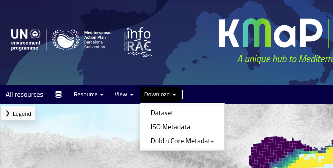

    Download menu for data and metadata

Interactive Preview
-------------------

You can hide the information panel choosing the *X* button on the top right. To show again the 
information panel displays the dataset rendered on a
basemap. You can:

* Pan and zoom using mouse or touch gestures.
* Click on a feature to open a **pop-up** showing its attribute values.
* Use the layer panel ( icon) to toggle visibility or inspect the legend.

.. note::
   The preview is a live, interactive map — not a static image. You can explore the
   data spatially before deciding whether to download or use it.

Download dataset