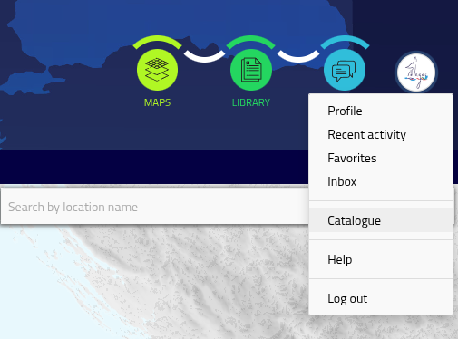
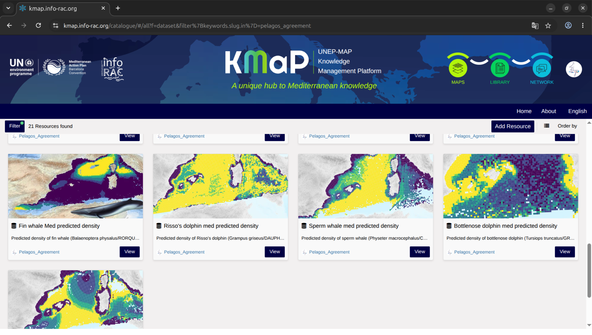
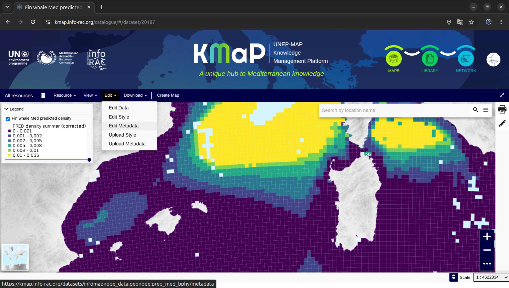
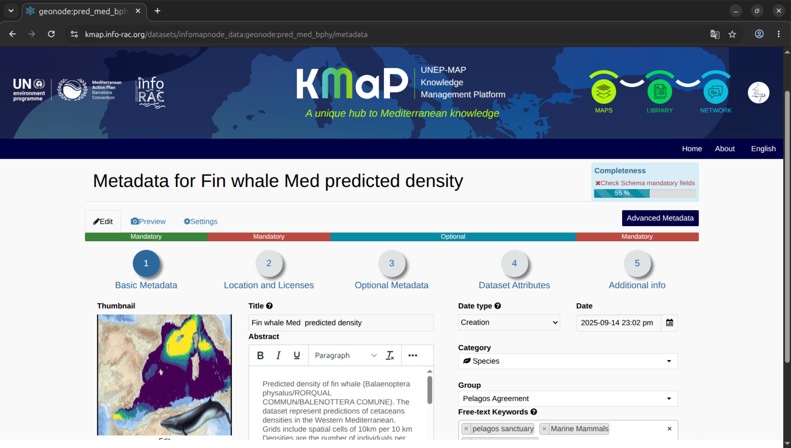

.. _metadata_en:

====================
Managing Metadata
====================

.. contents:: On this page
   :local:
   :depth: 2

Good metadata is what makes a resource discoverable and trustworthy. This section
explains how to view and edit the metadata of a Dataset or Document in KMaP.

.. note::
   You can only edit the metadata of resources that you **own** or for which you have
   been granted **edit permissions**. Members of the Pelagos Agreement group may have
   edit rights on resources shared within the group — check with your group administrator
   if you are unsure.

Who Can Edit Metadata?
=======================

KMaP has a permission model with several levels:

.. list-table::
   :widths: 25 75
   :header-rows: 1

   * - Role
     - Metadata editing rights
   * - **Resource owner** ans **Superusers**
     - Full edit rights on data and metadata fields.
   * - **Pelagos Group member (editor)**
     - Can edit resources explicitly shared with the group with *edit* permission.
   * - **Viewer / public**
     - Read-only access. Cannot edit metadata.

If you see an **Edit** button on the resource detail page, you have the right to edit
that resource's metadata. All users in contributors group have access to the 

Opening the detail page in edit mode
====================================

If you open a resource from the **maps** menu the detail page is showed in read-only mode, as a contributor user you have an acces to 
TO open the catalogue in edit mode select the **Catalogue** entry from the user menu.
Fist Click on the user logo  on the top right corner and then on the  **Catalogue** link.
You can also go directly to the url https://kmap.info-rac.org/catalogue/.

    Catalogue entry in user's menu

The catalogue view in edit mode lists all resources and filters as already explained in the :ref:`find_en``
section. You can see the difference because there is an **Add Resource** button in the top right
of the section and the page does not show other section (**navigate by theme** and **recently added**).

    Catalogue page in edit mode

Navigate to the resource detail page (see :ref:`filtering` for how to find a resource).
On the dataset preview page you have an  **Edit** menu, select the entry **Edit Metadata**.

    The edit menu in detail dataset page

Overview of the Metadata Editor
=================================

    The metadata editor page

The metadata editor is organised into tabs. The most important tabs are:

.. list-table::
   :widths: 25 75
   :header-rows: 1

   * - Tab
     - Content
   * - **Basic Metadata**
     - Title, thumbnail, date fields, abstract,  category, group, keywords, UNEP-MAP themes point of contact.
   * - **Location and licences**
     - Language, region, license, attribution, data quality statement.
   * - **Optional metadata**
     - Point of Contact, related resources on the platform and additional ISO 19115 fields (edition, purpose, supplemental information, …).
   * - **Dataset attributes** (vector datasets)
     - Label, description visibility and display order of attribute fields.
   * - **Additional info**
     - Access contrstaints, resolution and accuracy.     

Editing Key Metadata Fields
=============================

Title
-----

The **title** is the primary way users find your resource. It should be:

* Descriptive and specific (avoid generic titles like "Data" or "Map layer").
* Consistent with the naming conventions used by the Pelagos Agreement group.

To edit: click on the **Title** field in the *Basic info* tab and type your changes.

Abstract
--------

The **abstract** is a plain-language description of the resource. A good abstract answers:

* What does this resource contain?
* What geographic area does it cover?
* What time period does it represent?
* What is it used for?
* What are its known limitations?

The abstract field supports basic formatting. Aim for at least two or three sentences.

Keywords
---------

Keywords are the primary mechanism for filtering and discovering resources in KMaP.

.. important::
   All resources related to the Pelagos Agreement **must include** at least one of the
   following keywords:

   * ``pelagos sanctuary``
   * ``pelagos agreement``

   Without these keywords, your resource will not appear when other group members
   filter the catalogue by these terms.

To add a keyword:

1. In the **Keywords** field, start typing the keyword.
2. If the keyword already exists in the system, it will appear in a dropdown — select it.
3. If it is new, type the full keyword and press **Enter** or click **Add**.
4. To remove a keyword, click the **×** next to it.

Category
--------

The **category** assigns the resource to a thematic classification.
Select the most appropriate category from the dropdown:

* Fishery and Aquaculture
* Marine Biodiversity
* Pollution
* Climate Change
* Marine Spatial Planning
* Sustainability and Blue Economy
* Governance

A resource can belong to only one primary category. Use keywords for additional
thematic tagging.

Date Fields
-----------

Three date fields are available:

.. list-table::
   :widths: 30 70
   :header-rows: 1

   * - Field
     - Description
   * - **Date** (creation date)
     - When the resource was originally created or the data was collected since this date .
   * - **Publication date**
     - When the resource was published on KMaP.
   * - **Revision date**
     - When the resource was last updated.

Keep these dates accurate — they are used to filter and sort resources in the catalogue.

Licence
-------

The **licence** defines how others may use the resource.

1. Go to the **Location and licences** tab.
2. Select a licence from the dropdown. Common options include:

   * *Creative Commons Attribution (CC BY)* – free reuse with attribution.
   * *Creative Commons Attribution ShareAlike (CC BY-SA)* – reuse with attribution and
     same licence.
   * *Open Database Licence (ODbL)* – for datasets.
   * *No restrictions* – public domain.

.. note::
   If you are unsure which licence to apply, consult your group administrator. Applying
   the wrong licence may restrict the reuse of your data inappropriately.

Point of Contact
----------------

The **point of contact** identifies who to contact for questions about the resource.
It can be a person or an organisation.

1. In the *Basic info* tab, find the **Point of contact** field.
2. Start typing a name to search registered KMaP users, or enter an organisation name.

Thumbnail
---------

The **thumbnail** is the preview image displayed in catalogue cards. It is generated
automatically for Datasets and Maps, but can be replaced manually:

1. Click **Edit** on the detail page.
2. Select **Edit thumbnail**.
3. Upload a new image (recommended: 600 × 400 px, JPEG or PNG).

Saving Your Changes
===================

When you have finished editing, scroll to the bottom of the editor and click
**Save** (or **Update** — the label may vary). A confirmation message will appear.

.. warning::
   Metadata changes are applied immediately and are visible to all users with access to
   the resource. There is no draft or staging mode.

After saving, you are returned to the resource detail page where you can verify that
all fields have been updated correctly.

Metadata Completeness Checklist
================================

Use the following checklist before publishing or sharing a resource:

.. list-table::
   :widths: 10 90
   :header-rows: 1

   * - ✓
     - Item
   * - ☐
     - Title is descriptive and specific.
   * - ☐
     - Abstract explains what, where, when, and why.
   * - ☐
     - At least one Pelagos keyword is present (``pelagos sanctuary`` or
       ``pelagos agreement``).
   * - ☐
     - Category is set.
   * - ☐
     - Spatial extent is defined and covers the correct area.
   * - ☐
     - Date fields are filled in.
   * - ☐
     - Licence is set.
   * - ☐
     - Point of contact is identified.
   * - ☐
     - Thumbnail is representative.
