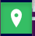

.. _maps_en:

=================
Exploring Maps
=================

A **Map** in KMaP is an interactive, multi-layer web map built from one or more Datasets.
This section explains how to find, open, and navigate Maps, how to work with layers, and
how to extract information from the data displayed.

Geonode use `Mapstore <https://mapstore.io/>` map viewer to interact with the maps.
See also the Mapstore `documentation <https://docs.mapstore.geosolutionsgroup.com/en/latest/>` for advanced use of map viewer.

Finding a Map
==============

Maps are listed in the catalogue alongside all other resource types. To filter the
catalogue to show only Maps:

1. Open the catalogue: click **Maps** in the top navigation bar.
2. In the filter panel on the left, under **Resource type**, select **Map**.
3. To find Pelagos-related maps, also apply the keyword filter:
   in the **Keywords** field, type ``pelagos sanctuary`` or ``pelagos agreement``.

Alternatively, search for a map by title using the search bar.

  .. figure:: ../_static/map_cat_view.png
      :align: center
      :width: 70%

      Map view button 

Click on :guilabel:`View` button on a Map card to open it in the interactive map viewer.

.. _map_viewer:

The Map Viewer Interface
=========================

The map viewer (powered by **MapStore**) opens in a full-screen layout.
_static/map_view.png

  .. figure:: ../_static/map_view.png
      :align: center
      :width: 100%

      Map view components 

Its main interface elements are:

.. list-table::
   :widths: 10 30 70
   :header-rows: 1

   * - ref
     - Element
     - Description
   * - 1
     - **Main map canvas**
     - The central interactive map area.
   * - 2
     - **Layer panel**
     - Toggles layer visibility, reorders layers, display legend, accesses layer settings.
   * - 3
     - **Basemap switcher**
     - Changes the background map. By default use a light background map hosted by Info-Rac
   * - 4
     - **Navigation Bar**
     - Zoom in and out. Query tool and 3D view
   * - 5
     - **Search bar**
     - Type in to search by location, name and coordinates.
   * - 6
     - **Sidebar**
     - Contains print, add layers and measure tools
   * - 7
     - **Menu tools**
     - Link to catalog (*All resources*), show map info, save and share the map, edit metadata and add dataset to the map.

Navigating the Map
===================

Basic Navigation
----------------

.. list-table::
   :widths: 35 65
   :header-rows: 1

   * - Action
     - How to perform it
   * - **Pan (move the map)**
     - Click and drag on the map canvas.
   * - **Zoom in**
     - Scroll the mouse wheel forward, click **+**, or double-click on the map.
   * - **Zoom out**
     - Scroll the mouse wheel backward or click **−**.
   * - **Zoom to full extent**
     - Click the *Home* icon (🏠) in the toolbar to return to the default view.
   * - **Zoom to a layer**
     - In the Layer panel, right-click a layer and select *Zoom to layer extent*.

Going to a Specific Location
-----------------------------

Use the **Search bar**  to search for a place name.
Type the name and press Enter — the map will zoom to that location. 
The place names are geocoded using `nominatim <https://nominatim.openstreetmap.org>`

Working with Layers
====================

Table of Conetnts (TOC)
------------------------

Click the |layer_toggle|  icon to open the TOC. It lists all layers included
in the map, divded into different groups and subgroups: you can expand and collapse the
groups by clicking the :guilabel:`>` on the left of the layer name.

Layer names mostly reflects the layer title but the map author can change them.
The link to the effective layers/datasts is listed in the map information > linked resources

Toggling Layer Visibility
--------------------------

Each layer in the panel has a **radio button** . Click it to show or hide that layer.
Hidden layers remain in the map composition but are not displayed on the canvas.
If the group is a **mutally exclusive group** only one layer at time can be visible. 
Check the group settings with right click on the group name and opn the context menu

.. figure::../_static/map_view_layer_group_menu.png
      :align: center
      :width: 70%

      Layer group context menu

Changing Layer Order
---------------------

Layers are drawn in the order they appear in the panel (top layers are drawn on top).
To reorder:

1. Click and hold a layer name in the panel.
2. Drag it up or down to the desired position.
3. Release to drop.

Viewing the Legend 
-------------------

Click the :guilabel:` > ` arrow to a layer name and the legend is shown under the layer.
Use the **Opacity** slider at the bottom to set transparency between 0 % (invisible) and 100 % (solid).

Compare two layers
-------------------

When two solid layers overlaps the **opacity** control can be not sufficent to compare them.
Mapstore provide a **Swipe tool** to compare different layers. 

1. First make visibile the bottom layer checking its radio button.
2. Select the layer on top that will covers the first layer and make it visibile as well
3. Right click on the second layer and select **Swipe tool**
4. A vertical line will appear on the map: on the left the selected layer is transparent and on the right is visible.
5. Move the swipe line dragging it by mouse or pan and zoom the map to compare the two layers.

.. figure::../_static/swipe01.png
      :align: center
      :width: 70%

      How to open the swipe tool

.. figure::../_static/swipe02.png
      :align: center
      :width: 70%

      The swipe tool in action

Time based layers
-----------------

Mapstore viewer can manage also layers with **time** dimension. See for instances the map about
pelagos **ToR2** at `https://kmap.info-rac.org/catalogue/#/map/20208`.
Since it contains the remote layer of monthly  vessel density from `Emodnet server <https://emodnet.ec.europa.eu/geoviewer/?layers=12707@0f2f3ff1-30ef-49e1-96e7-8ca78d58a07c:1:1,12432@5d89d371-a52a-476b-92de-a423f6d2c15d:1:0,12445@5d89d371-a52a-476b-92de-a423f6d2c15d:1:0&basemap=ebwbl&active=12707&bounds=-419329.86269369797,4523009.9685573215,1271431.3853908484,5643139.295413333&filters=&projection=EPSG:3857>`
When the map opens with a Timeline control on the bottom. Altought this remote service is not fuly compatible with Mapstore
you can still move from monthlyframes using **Up** and **Down** arrows over the month field.

.. figure::../_static/map_view_timeline.png
      :align: center
      :width: 70%

      Timeline control

Querying Features
==================

The **Query tool** |query_tool| is active by default in the navigation bar.

Click on any visible feature (point, line, or polygon) on the map canvas and in the side panel which 
displays the attribute values associated with the feature under the pin, or the cell value of the raster.

If no layer is selected a dropdown list with all the layer with a feature that intersects the query point is showed.

.. figure::../_static/map_view_query_multi.png
      :align: center
      :width: 70%

      Query with multiple layers

If a layer is selected on the TOC the panel sows only features/values from that layer. 
To deselect a layer click again over the layer name.

.. figure::../_static/map_view_query_selected.png
      :align: center
      :width: 70%

      Query with the layer *Winter fin whale...* selected

.. _filtering_features:

View attribute table  and filtering Features
---------------------------------------------

For vector layers, MapStore can show the attribute table and filter features by attribute or by area.
Select a layer in the TOC and click on the **attribute table** icon 

.. figure::../_static/map_view_attribute_table.png
      :align: center
      :width: 70%

      Attribute table icon on the TOC

The attribute table will open on the bottom of the map.
You can resize the panel by dragging the top border with mouse.
On the top left of the attribute panel click on the **Advanced search** button.

.. figure::../_static/map_view_attribute_filter_but.png
      :align: center
      :width: 70%

      Advanced search button 

On the left panel are the filter options, you can use **attribute filter** combining different conditions.
You can also filter by area of interests and a target layer. Figure below shows an attribute filter 
on **Ports and moorings** layer in **ToR2 map**. 
Given this conditions only Features that have `country=Italy` and `capacity>100` are shown from the layer.

.. figure::../_static/map_view_attribute_filter.png
      :align: center
      :width: 70%

      Filter by attributes value

Filtered dataset can also be exported as a new dataset, click on the **download data** |download_dataset_but|
and in the next window select **Download filtered dataset** checkbox.

.. figure::../_static/map_view_filtered_export.png
      :align: center
      :width: 70%

      Download Filtered dataset

Measurement Tools
==================

Distance Measurement
---------------------

1. Click the **Measure** tool in the sidebar.
2. Select **Distance**, **Area**, or **Bearing**
3. Click points on the map to define a line. Double-click to end.
4. The total distance is displayed in the unit of your choice (km, miles, nm).

Area Measurement
-----------------

1. Click the **Measure** tool.
2. Select **Area**.
3. Click to define the vertices of a polygon. Double-click to close.
4. The calculated area is displayed.

.. note::
   Measurements are performed on the map projection and may have small geometric
   inaccuracies for large areas. For precise measurements, use a desktop GIS application.

Exporting the Map View
=====================================

Share / Permalink 
-----------------

To share the current map view (including zoom level, active layers, and centre point):

1. Click the **Share** button (link icon) in the toolbar.
2. A permalink URL is generated. Copy and share this URL — recipients will open the map
   in the same state.

The permalink could be used by users that already have access rights to the map.

Embed
-----

1. Click the **Share** button.
2. Switch to the **Embed** tab.
3. Copy the HTML ``<iframe>`` code and paste it into your website or report.

.. figure::../_static/map_view_share_embed.png
      :align: center
      :width: 70%

      Share and embed options for a map

.. warning::
  If you embed a map in an external website please be sure that all the layers 
  and the map itself are publicly accessible. Log out and test as a non-logged user.

Saving Changes to a Map
========================

If you have **edit permission** on a Map, you can save changes to the map configuration that include  layers, styles, and
the initial view:

1. Make your changes in the map viewer (reorder layers, change styles, set a new
   initial extent, etc.).
2. Select the **Save** entry from **Resource** menu.
3. Choose **Save** (overwrite the existing map) or **Save as** (create a new map).

.. figure::../_static/map_view_save.png
      :align: center
      :width: 70%

      Saving a map

.. warning::
   Saving overwrites the map for all users who have access to it.
   If you want to experiment without affecting others, use **Save as** to create a
   personal copy first.

Creating a New Map
==================

Members of the Pelagos Agreement group with appropriate permissions can create new Maps:

1. Open the **Catalogue** in `edit mode <Opening the detail page in edit mode>`
2. Click **Add Resource**  button at the top of the catalogue.
3. The map viewer opens with an empty canvas.
4. Use the **Add layer** menu to search for and add
   Datasets from the KMaP catalogue.
5. Arrange the layer order Style each layer as needed.
6. Click **Save** and provide a title, abstract, and keywords
   (remember to include ``pelagos sanctuary`` or ``pelagos agreement``).
